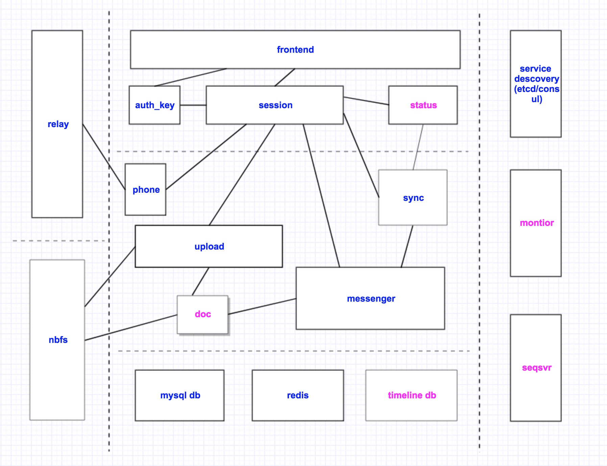

# NebulaChat - Open source [mtproto](https://core.telegram.org/mtproto) server written in golang
> open source mtproto server implemented in golang with compatible telegram client.

### Introduce
Open source [mtproto](https://core.telegram.org/mtproto) server written in golang

### Architecture


### Documents
[Diffie–Hellman key exchange](doc/dh-key-exchange.md)

[Creating an Authorization Key](doc/Creating_an_Authorization_Key.md)

[Mobile Protocol: Detailed Description (v.1.0, DEPRECATED)](doc/Mobile_Protocol-Detailed_Description_v.1.0_DEPRECATED.md)

[Encrypted CDNs for Speed and Security](doc/cdn.md) Translate By [@steedfly](https://github.com/steedfly)

[Windows-Build](doc/windows-build.md) By [@robinfoxnan](https://github.com/robinfoxnan)

### Quick start with Docker

1. Install `docker` and `docker-compose`
2. Edit `docker-compose.yml`: replace `CHATENGINE_HOST` to your own host IP
3. Run `make` command in your shell.
4. Now, `Chatengine` is running on your host port `12345`.

#### Docker run demo

```shell
git clone https://github.com/nebula-chat/chatengine
cd chatengine
# replace 192.168.1.100 to you own host IP.
sed -i "" 's/CHATENGINE_HOST=127.0.0.1/CHATENGINE_HOST=192.168.1.100/g' docker-compose.yml # macOS
# sed -i 's/CHATENGINE_HOST=127.0.0.1/CHATENGINE_HOST=192.168.1.100/g' docker-compose.yml # linux
make
```

### Manual Build and Install
#### Depends
- redis
- mysql
- etcd

#### Build

- Get source code　
```
mkdir -p $GOPATH/src/github.com/nebula-chat/
cd $GOPATH/src/github.com/nebula-chat/
git clone https://github.com/nebula-chat/chatengine.git

```

- Build
    ```
#    build frontend
        cd $GOPATH/src/github.com/nebula-chat/chatengine/access/frontend
        go build
    
#    build auth_key
        cd $GOPATH/src/github.com/nebula-chat/chatengine/access/auth_key
        go build

#    build auth_session
        cd $GOPATH/src/github.com/nebula-chat/chatengine/service/auth_session
        go build
        
#    build sync
        cd $GOPATH/src/github.com/nebula-chat/chatengine/messenger/sync
        go build
    
    # build upload
        cd $GOPATH/src/github.com/nebula-chat/chatengine/messenger/upload
        go build
    
    # build document
        cd $GOPATH/src/github.com/nebula-chat/chatengine/service/document
        go build

    # build biz_server
        cd $GOPATH/src/github.com/nebula-chat/chatengine/messenger/biz_server
        go build
        
    # build session
        cd $GOPATH/src/github.com/nebula-chat/chatengine/access/session
        go build
    ```

- Run
    ```
    cd $GOPATH/src/github.com/nebula-chat/chatengine/service/auth_session
    ./auth_session
    
    cd $GOPATH/src/github.com/nebula-chat/chatengine/service/document
    ./document

    cd $GOPATH/src/github.com/nebula-chat/chatengine/messenger/sync
    ./sync
    
    cd $GOPATH/src/github.com/nebula-chat/chatengine/messenger/upload
    ./upload

    cd $GOPATH/src/github.com/nebula-chat/chatengine/messenger/biz_server
    ./biz_server

    cd $GOPATH/src/github.com/nebula-chat/chatengine/access/auth_key
    ./auth_key

    cd $GOPATH/src/github.com/nebula-chat/chatengine/access/session
    ./session
    
    cd $GOPATH/src/github.com/nebula-chat/chatengine/access/frontend
    ./frontend
    ```

#### More
[Build document](doc/build.md)

[Build script](scripts/build.sh)

[Prerequisite script](scripts/prerequisite.sh)


#### **Note**
> **`import all scripts/*.sql`**

### Compatible clients
**Important**: default signIn and signOut verify code is **12345**

[Android client for NebulaChat](https://github.com/nebula-chat/clients/tree/master/Telegram-Android)

[FOSS client for NebulaChat](https://github.com/nebula-chat/clients/tree/master/Telegram-FOSS)

[iOS client for NebulaChat](https://github.com/nebula-chat/clients/tree/master/Telegram-iOS)

[tdesktop for NebulaChat](https://github.com/nebula-chat/clients/tree/master/tdesktop)


### TODO

## Feedback
Please report bugs, concerns, suggestions by issues.

## Notes
Chatengine is not a commercial project, only supports mtproto API layer 86, and only supports private chats and small groups. 

If need enterprise edition, please PM the [author](https://t.me/benqi) or download clients from [nebula.chat](https://nebula.chat) (default verify code is: 12345).

