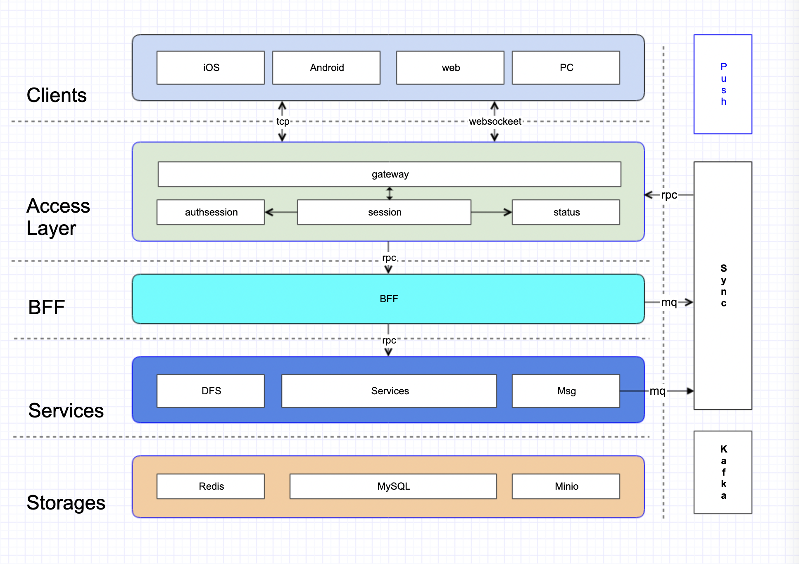

# Teamgram - Unofficial open source [mtproto](https://core.telegram.org/mtproto) server written in golang
> open source mtproto server implemented in golang with compatible telegram client.

## Introduce
Open source [mtproto](https://core.telegram.org/mtproto) server implementation written in golang, support private deployment.

## Features
- MTProto 2.0
  - Abridged
  - Intermediate
  - Padded intermediate
  - Full
- API Layer: 186
- private chat
- basic group
- contacts
- web

## Architecture


## Installing Teamgram 
`Teamgram` relies on high-performance components: 

- **mysql5.7**
- [redis](https://redis.io/)
- [etcd](https://etcd.io/)
- [kafka](https://kafka.apache.org/quickstart)
- [minio](https://docs.min.io/docs/minio-quickstart-guide.html#GNU/Linux)
- [ffmpeg](https://www.johnvansickle.com/ffmpeg/)

Privatization deployment Before `Teamgram`, please make sure that the above five components have been installed. If your server does not have the above components, you must first install Missing components. 

- [Centos9 Stream Build and Install](docs/install-centos-9.md) [@A Feel]
- [CentOS7 teamgram-server环境搭建](docs/install-centos-7.md) [@saeipi]

If you have the above components, it is recommended to use them directly. If not, it is recommended to use `docker-compose-env.yaml`.


### Source code deployment
#### Install [Go environment](https://go.dev/doc/install). Make sure Go version is at least 1.17.


#### Get source code　

```
git clone https://github.com/teamgram/teamgram-server.git
cd teamgram-server
```

#### Init data
- init database

	```
	1. create database teamgram
	2. init teamgram database
		mysql -uroot teamgram < teamgramd/sql/1_teamgram.sql
		mysql -uroot teamgram < teamgramd/sql/migrate-20220321.sql
		mysql -uroot teamgram < teamgramd/sql/migrate-20220326.sql
		mysql -uroot teamgram < teamgramd/sql/migrate-20220328.sql
		mysql -uroot teamgram < teamgramd/sql/migrate-20220401.sql
		mysql -uroot teamgram < teamgramd/sql/migrate-20220412.sql
		mysql -uroot teamgram < teamgramd/sql/migrate-20220419.sql
		mysql -uroot teamgram < teamgramd/sql/migrate-20220423.sql
		mysql -uroot teamgram < teamgramd/sql/migrate-20220504.sql
		mysql -uroot teamgram < teamgramd/sql/migrate-20220721.sql
		mysql -uroot teamgram < teamgramd/sql/migrate-20220826.sql
		mysql -uroot teamgram < teamgramd/sql/migrate-20220919.sql
		mysql -uroot teamgram < teamgramd/sql/migrate-20221008.sql
		mysql -uroot teamgram < teamgramd/sql/migrate-20221011.sql
		mysql -uroot teamgram < teamgramd/sql/migrate-20221016.sql
		mysql -uroot teamgram < teamgramd/sql/migrate-20221023.sql
		mysql -uroot teamgram < teamgramd/sql/migrate-20221101.sql
		mysql -uroot teamgram < teamgramd/sql/migrate-20221127.sql
		mysql -uroot teamgram < teamgramd/sql/migrate-20230707.sql
		mysql -uroot teamgram < teamgramd/sql/migrate-20240107.sql
		mysql -uroot teamgram < teamgramd/sql/migrate-20240108.sql
		mysql -uroot teamgram < teamgramd/sql/migrate-20240111.sql
		mysql -uroot teamgram < teamgramd/sql/migrate-20240112.sql
		mysql -uroot teamgram < teamgramd/sql/migrate-20240113.sql
		mysql -uroot teamgram < teamgramd/sql/migrate-20240114.sql
		mysql -uroot teamgram < teamgramd/sql/migrate-20240420.sql
		mysql -uroot teamgram < teamgramd/sql/migrate-20240620.sql
		mysql -uroot teamgram < teamgramd/sql/migrate-20240828.sql
		mysql -uroot teamgram < teamgramd/sql/z_init.sql
	```

- init minio buckets
	- bucket names
	  - `documents`
	  - `encryptedfiles`
	  - `photos`
	  - `videos`
	- Access `http://ip:xxxxx` and create


#### Build
	
```
make
```

#### Run

```
cd teamgramd/bin
./runall2.sh
```

### Docker deployment
#### Install [Docker](https://docs.docker.com/get-docker/)

#### Install [Docker Compose](https://docs.docker.com/compose/install/)

#### Get source code

```
git clone https://github.com/teamgram/teamgram-server.git
cd teamgram-server
```

#### Run

```  
# run dependency
docker-compose -f ./docker-compose-env.yaml up -d

# run docker-compose
docker-compose up -d
```
	
## Compatible clients
**Important**: default signIn verify code is **12345**

[Android client for Teamgram](clients/teamgram-android.md)

[iOS client for Teamgram](clients/teamgram-ios.md)

[tdesktop for Teamgram](clients/teamgram-tdesktop.md)

## Feedback
Please report bugs, concerns, suggestions by issues, or join telegram group **[Teamgram](https://t.me/+TjD5LZJ5XLRlCYLF)** to discuss problems around source code.

## Notes
If need enterprise edition:

- sticker/theme/wallpaper/reactions/2fa/sms/push(apns/web/fcm)/secretchat/scheduled/...
- channel/megagroup
- audiocall/videocall/groupcall
- bots

please PM the **[author](https://t.me/benqi)**

## Give a Star! ⭐

If you like or are using this project to learn or start your solution, please give it a star. Thanks!

## Visitors Count

