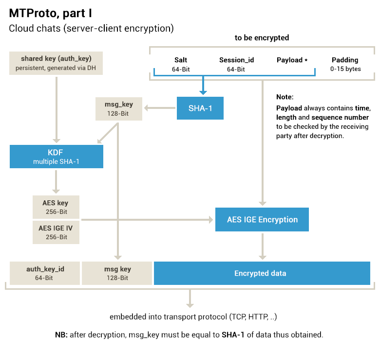

# Mobile Protocol: Detailed Description (v.1.0, DEPRECATED)
> 本文档介绍了MTProto v.1.0，其状态为DEPRECATED。
> 有关最新的Telegram clients使用的加密信息，请参阅[MTProto 2.0](https://core.telegram.org/mtproto/description)。

在使用传输协议通过网络传输一条消息（或多条消息（Multipart messages）组装成一条container消息）之前，会以特定的方式对消息进行加密，并且在消息的顶部添加外部头部：一个64位密钥标识符（唯一标识服务器和用户的授权密钥）和一个128位的消息密钥。

用户密钥和消息密钥一起定义了一个实际的256位密钥和一个256位的初始化向量，消息使用IGE的AES-256加密。 请注意，要加密的消息头包含明显影响消息密钥（以及AES密钥和iv）的可变数据（session, message ID, sequence number, server salt）。 消息密钥被定义为消息体的SHA1的低128位（包括session, message ID等）。Multipart messages消息被加密为单个消息。

## 术语

### Authorization Key
客户端设备和服务器共享的2048位密钥，由用户在客户端设备上注册时创建，通过Diffie-Hellman密钥交换，不会通过网络传输。 每个授权密钥只属于某个用户。一个用户可以拥有多个密钥（可实现多端同步功能），如果设备丢失，服务端会将该密钥永久锁定。 请参阅创[建授权密钥](https://core.telegram.org/mtproto/auth_key)。

### Server Key
服务器拥有一个2048位的RSA密钥，仅用于注册时生成授权密钥，客户端有一个内置的公钥，客户端可用于验证签名。私钥存储在服务器上，并且很少更改。

> 备注：握手阶段客户端会使用该密钥加密`new_nonce`！

### Key Identifier
授权密钥的SHA1哈希的低64位用于指示哪个特定密钥用于加密消息。密钥必须由其SHA1的低64位唯一地定义，并在发生冲突时重新生成授权密钥。密钥标识符为0意味着本条消息是非加密消息。

### Session
客户端生成的64位随机数，用于区分各个会话（例如，使用相同授权密钥创建的应用程序的不同实例之间）。Session连同`auth_key_id`对应于一个应用实例。服务器会维护会话状态以保证在任何情况下都不能将一个会话的消息发送到不同的会话中。客户能处理一些极端情况，（比如服务端资源受限、服务端crash等）服务器可能会忘记或丢弃任何客户端的会话。

### Server Salt
定期（例如，每24小时）根据服务端请求（基于每个session）而改变的一个随机64位数）。所有后续消息必须包含新的salt（尽管旧的salt的消息仍然可以接受300秒）。主要用于防止重放攻击和某些与在不久的将来调整客户端时钟相关的技巧。

### Message Identifier (msg_id)
一个（时间相关的）64位数字，用来唯一标识一个会话内的消息。客户端消息的`msg_id`可被4整除，如果是服务端对客户端的响应消息，则服务端的`msg_id`模4值为1，非客户端的响应则模4值为3。客户端`msg_id`必须单调递增（在单个Session中），并且与服务器消息标识符一样，必须大约等于unixtime * 2 ^ 32。这样，`msg_id`与消息创建时的时间 大致一样。一条消息在被创建后300秒或创建前30秒被拒绝（这是防止重放攻击所必需的）。在被拒绝的这种情况下，必须重新发送一个不同的`msg_id`（或放在一个`msg_id`较高的container中）。container的`msg_id`必须严格大于其嵌套消息的标识符。

重要：为了防止重放攻击，客户端传递的msg_id的低32位不能为空，并且在创建消息时必须显示时间点的小数部分。在不久的将来，服务器将开始忽略消息，其中msg_id的低32位包含太多的零。

### Content-related Message
需要明确ack的消息。包括所有用户和许多服务消息，几乎所有的消息都是容器和ack需要的消息。

### Message Sequence Number (msg_seqno)
一个32位的数字等于发送者在这个消息之前创建的“内容相关的”消息的数量的两倍（那些需要确认的消息，特别是那些不是容器的数量），并且如果当前消息是内容相关的消息。一个容器总是在其全部内容之后生成;因此，其序列号大于或等于其中包含的消息的序列号。

### Message Key
要加密的消息部分（包括内部头，不包括对齐字节）的SHA1的低128位。

### Internal (cryptographic) Header
16字节的内部消息头，(由server_salts + session_id组成)

### External (cryptographic) Header
24字节的外部消息头（由auth_key_id + msg_key组成）

### Payload
外部头+加密的消息或container。

## Defining AES Key and Initialization Vector
2048位的授权秘钥(Authorization Key, auth_key)和128位的消息秘钥(Message Key, msg_key)用于计算一个256位的AES秘钥(aes_key)以及一个256位的初始化向量(aes_iv), 他们随后用于加密协议包的消息正文部分.(例如, 除了外部头的所有其他部分), 加密模式为IGE(Infinite Garble Extension, 无限混淆扩展)模式.

从 auth_key和 msg_key, 计算aes_key, aes_iv, 计算方法如下:

- `msg_key = substr (SHA1 (plaintext), 4, 16)`;
- `sha1_a = SHA1 (msg_key + substr (auth_key, x, 32))`;
- `sha1_b = SHA1 (substr (auth_key, 32+x, 16) + msg_key + substr (auth_key, 48+x, 16))`;
- `sha1_с = SHA1 (substr (auth_key, 64+x, 32) + msg_key)`;
- `sha1_d = SHA1 (msg_key + substr (auth_key, 96+x, 32))`;
- `aes_key = substr (sha1_a, 0, 8) + substr (sha1_b, 8, 12) + substr (sha1_c, 4, 12)`;
- `aes_iv = substr (sha1_a, 8, 12) + substr (sha1_b, 0, 8) + substr (sha1_c, 16, 4) + substr (sha1_d, 0, 8)`;

x 为字节偏移量, 消息的方向不同, x 的值不同.

其中 x =0 时, 消息为客户端到服务器的消息(Client->Server), x = 8是为从服务器到客户端的消息(Server->Client). auth_key 的低1024位在计算中不涉及加密, 他们可以用于客户端设备加密从服务器端接收到的本地数据. auth_key 的低512位不存储在服务器; 因此, 如果客户端设备使用他们来加密本地数据, 并且用户丢失了秘钥或密码, 数据是不可能解密的(即使可以从服务器获取数据)

当AES用于加密一个不能被16整除的数据块, 在数据被加密之前, 整个数据块的长度必须被补齐到16的整数倍.

## Important Tests
当接收到一条加密的消息时，必须检查`msg_key`实际上等于先前加密部分的SHA1哈希的低128位，并且`msg_id`对于来自客户机到服务器的消息具有偶校验，并且奇校验用于从服务器到客户端的消息。

另外，必须存储从对方接收到的最后N个消息的标识符（`msg_id`），并且如果消息以低于全部或等于任何存储值的`msg_id`进入，则该消息将被忽略。否则，新消息`msg_id`被添加到该集合，并且如果存储的`msg_id`值的数量大于N，则最旧的（即最低的）被遗忘。

另外，属于将来超过30秒或超过300秒的msg_id值将被忽略。这对服务器来说尤其重要。客户端也会发现这是有用的（防止重播攻击），但只有当它是一定的时间（例如，如果其时间已经与服务器的时间同步）。

包含客户端发送给服务器的数据的某些客户端到服务器服务消息（例如，最近的客户端查询的`msg_id`）可能会在客户端上处理，即使时间似乎是“不正确的”。对于更改server_salt和无效客户端时间通知的消息尤其如此。请参阅移动协议：服务消息。

## Storing an Authorization Key on a Client Device

可以建议用户关注安全问题, 几乎以SSH相同的方对秘钥进行密码保护. 这是通过添加秘钥的SHA1到Key的前面, 随后整个字符串使用AES的CBC模式加密, 然后是一个等于用户密码的Key. 当用户输入密码时, 存储的保护密码被解密并且通过和SHA1对比进行校验. 从用户的角度, 这实际上和使用一个应用程序或一个Web站点密码是一样的.

## Unencrypted Messages
特殊的纯文本消息可以用于创建授权秘钥以及执行时间同步. 当 auth_key_id = 0 (64 位)是, 表示不存在auth_key. 这种情况是直接后跟序列号格式的消息体, 而不包含内部或外部头. 一个消息标识符(message Identifier 64位) 以及消息体字节长度(32字节)添加到消息体之前.

仅有少量的特殊类型的消息能通过明文传输.

## Schematic Presentation of Messages
### Encrypted Message
| `auth_key_id` | `msg_key` | `encrypted_data` |
|:-:|:-:|:-:|
| int64 | int128 | bytes |

加密数据结构: 

| `auth_key_id` | `session_id` | `message_id ` | `seq_no` |`message_data_length` |`message_data` | `padding 0..15` |
|:-:|:-:|:-:|:-:|:-:|:-:|:-:|
| int64 | int64 | int64 | int32 | int32 | bytes | bytes |

### Unencrypted Message

| `auth_key_id` | `message_id ` | `message_data_length` |`message_data` |
|:-:|:-:|:-:|:-:|
| int64(值为0) | int64 | int64 | bytes |

## 创建授权秘钥
Authorization Key 在客户端应用程序安装的时候自动生成, 注册过程发生在 Authorization Key 生成自后. 用户被提示完成注册表单, 同时Authorization Key在后台生成.

用户键盘输入的间隔用于生成高质量的随机数的熵的来源, 随机数用于 Authorization Key 的创建.

在 Authorization Key 创建过程中, 客户端获取其服务器的盐(Server Salt), 用于在将来和新的秘钥一起进行所有的通信. 客户端然后使用新生成的秘钥创建一个加密的会话, 随后的通信都在这个会话当中(包括用户注册信息的传输, 电话号码验证), 除非客户端创建了一个新的会话. 客户端可以在任何时候通过选择一个新的随机的会话ID(session_id)任意创建新的或额外的会话(多个应用程序实例需要创建不同的会话).

