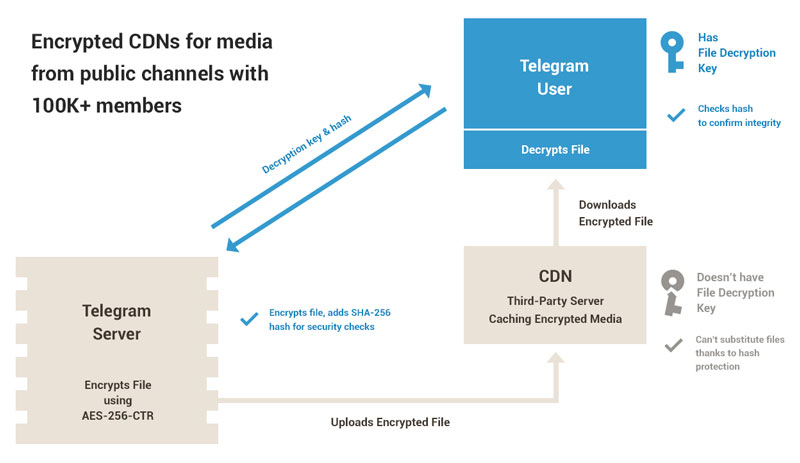

# 用于加速和安全的加密CDN
在正式应用程序4.2版发布后，Telegram客户端应用程序可能需要从辅助[内容传输网络](https://en.wikipedia.org/wiki/Content_delivery_network)数据中心下载在超过**100,000**人的channel发布的流行文件。这些CDN DC位于具有巨大Telegram流量的地区，但是因为各种原因，我们不希望在那里放置Telegram服务器。

CDN DC不是Telegram云的一部分，应该被视为敌国的领土。为此，每个要发送到这些CDN DC的文件都使用唯一的AES-256-CTR密钥进行加密。CDN **无法访问**其存储**的数据**，因为这些密钥只能由MTProto服务器和授权客户端访问。

> **另请参阅：** [有关高级常见问题的CDN和政府的更多信息](https://core.telegram.org/techfaq#encrypted-cdns) 

## 如何运转 
当来自具有〜**100,000**成员的channel的文件在特定区域变得流行时，Telegram服务器可以用唯一的AES-256-CTR密钥对该文件进行加密，并将其发送到相关的CDN DC进行存储。

当文件存储在靠近最终用户的CDN DC中时，下载速度将会更高，因为数据需要传输更短的距离，并可能避免区域之间存在的很多瓶颈。

这是安全的，因为将CDN DC安全性和第三方互联网提供商同等对待：
- CDN DC没有存储在那里的文件的密钥，所以即使这个DC受到攻击，它们也不能访问数据。
- 客户端收到数据时会检测文件片段的SHA-256哈希值，以防止数据被篡改。
- 没有私人数据存储在CDN DC中或发送给CDN DC。
- 该服务器只允许拥有超过**10万**用户的channel的媒体文件缓存在CDN DC中（包括从这些频道转发的媒体文件和源自其他大型公共频道的病毒式传播的媒体文件）。



CDN的通信是受限的：主数据中心仅上传用于存储的加密文件，并且不接受来自CDN的数据。客户端应用程序仅下载加密文件并且不接受其他更新。客户端应用程序获取必要的密钥以解密来自主电报服务器的文件，并通过其哈希来验证文件的完整性。这意味着CDN只能提供正确的文件 - 任何不一致的文件都将立即被客户端丢弃。

CDN DC不会将文件存储在硬盘上 - 仅在内存中存储。当CDN服务器内存不足时，将使用简单的LRU算法来替换文件。

## CDN DC与主DC有何不同
- **CDN DC不可信。** 
- 客户端开发人员可以使用`help.getCdnConfig`来获取CDN DC的公共RSA密钥列表，这些密钥与主DC的公共RSA密钥不同。
- CDN DC仅支持以下方法`upload.getCdnFile`, `initConnection`, `invokeWithLayer`。
- 在使用CDN DC时，客户端开发人员必须记住，auth_key可能会在任何时候被删除（导致-404错误，在这种情况下必须生成新密钥）。
- 客户端应用程序不得接受来自CDN DC的任何更新（应用程序只应接受来自其与主DC的主连接的更新）。
- 客户不得将CDN DC的回复转换为为查询发送给其他DC。
- 客户端不允许通过 `initConnection`发送私有用户信息发送给CDN DC。

## 从CDN DC获取文件
API可能会在 `upload.getFile`调用后返回 `upload.fileCdnRedirect`。在这种情况下，客户端需要从CDN DC请求所需的文件。响应中**dc_id**是新CDN的ID。与主DC一样，CDN DC的IP地址可以在 `help.getConfig`查询。相应的_dcOption_将具有标志_cdn：flags.3？true_。

一旦与CDN DC成功建立连接，（确认CDN DC的公共RSA MTProto密钥与返回的列表中的一个匹配）后，客户端必须生成一个auth_key 。然后客户端必须为每个**offset**执行一次`upload.getCdnFile`。对于未知大小的文件，必须重复查询，直到返回空。

`upload.getCdnFile`可能会返回`upload.cdnFileReuploadNeeded`。在这种情况下，客户端需要向原始发送 `upload.getFile`请求的DC发送 `upload.reuploadCdnFile`请求。一旦`upload.reuploadCdnFile`执行成功，应用程序需要再次从CDN DC请求文件。

文件主DC是就是文件主备份原始存储的的DC（不要与用户的主DC相混淆） **fileLocation.dc_id**或**document.dc_id**。

## 解密文件
在 `upload.fileCdnRedirect`调用中,服务器返回该文件的解密KEY和IV（分别是字段 `encryption_key:bytes`和 `encryption_iv:bytes` ）。

从CDN DC接收到 `upload.cdnFile`内的部分加密数据后，客户端必须使用AES-256-CTR解密该数据。这段数据的IV是这样得到的：使用offset/16的值以big-endian的方式替换encryption_iv字段的最后4个字节。这样可以有效地解密文件并随机访问文件内容（例如，用于流式传输）。

## 验证文件
为了确认CDN DC发过来未被篡改的文件，客户端必须为每个下载的片段验证Hash值。`upload.fileCdnRedirect`,`upload.reuploadCdnFile`以及`upload.getCdnFileHashes`返回`cdnFileHash`结构体。这些结构体中的每一种都包含以文件offset开始，长度为limit字节的文件片段的SHA-256 Hash值。

在将从CDN DC接收的数据的块保存到文件之前，客户端必须确认其Hash符合从主DC收到的哈希值。如果缺少任何文件块的Hash，客户端开发人员必须调用`upload.getCdnFileHashes`方法来获取缺少的Hash值。

## 协议 
```
cdnFileHash offset:int limit:int hash:bytes = CdnFileHash;
upload.fileCdnRedirect dc_id:int file_token:bytes encryption_key:bytes encryption_iv:bytes cdn_file_hashes:Vector&lt;CdnFileHash&gt; = upload.File;
upload.cdnFileReuploadNeeded request_token:bytes = upload.CdnFile;
upload.cdnFile bytes:bytes = upload.CdnFile;
dcOption flags:# ipv6:flags.0?true media_only:flags.1?true tcpo_only:flags.2?true cdn:flags.3?true id:int ip_address:string port:int = DcOption;
cdnPublicKey dc_id:int public_key:string = CdnPublicKey;
cdnConfig public_keys:Vector&lt;CdnPublicKey&gt; = CdnConfig;
---functions---
// CDN DC
upload.getCdnFile file_token:bytes offset:int limit:int = upload.CdnFile;
// Master DC
upload.reuploadCdnFile file_token:bytes request_token:bytes = Vector&lt;CdnFileHash&gt;;
upload.getCdnFileHashes file_token:bytes offset:int = Vector&lt;CdnFileHash&gt;;
help.getCdnConfig = CdnConfig;
```

## upload.getFile和upload.getCdnFile参数的限制
- offset 必须可以被4096字节整除
- limit 必须可以被4096字节整除
- 10485760（1MB）必须可以被整除 
- limit -  offset / (1024 * 1024) == (offset + limit - 1) / (1024 * 1024)  （正在下载的文件部分必须始终位于同一M字节大小的片段中）

## 可能的错误及其含义

    upload.getCdnFile  FILE_TOKEN_INVALID  CDN-DC不接受file_token（例如令牌已过期）。继续使用upload.getFile从主DC中下载文件。

    upload.reuploadCdnFile  FILE_TOKEN_INVALID  主DC不接受file_token（例如令牌已过期）。继续使用upload.getFile从主DC中下载文件。

    upload.reuploadCdnFile  REQUEST_TOKEN_INVALID  主DC没有接受request_tokenCDN DC。继续使用upload.getFile从主DC中下载文件。