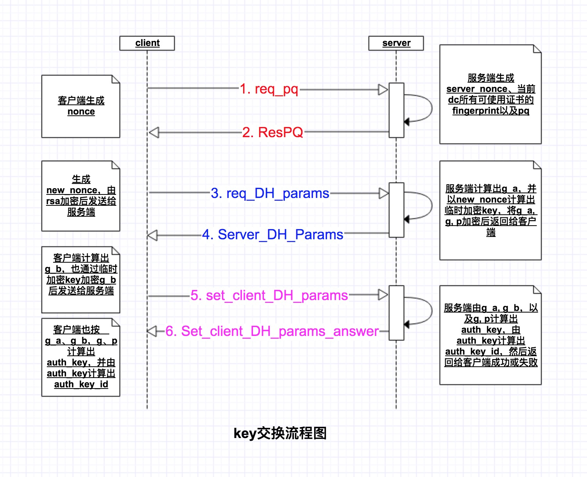

# Creating an Authorization Key
> [Creating an Authorization Key](https://core.telegram.org/mtproto/auth_key)
>
> 
> 创建auth_key时，客户端和服务端之间的交互消息也使用TL语言描述并使用二进制序列化，需要注意的是，传输时大数字（比如a、p以及ga、gb等）采用大端格式。Hash函数（如SHA1）返回值也使用大端格式的字符串（20个字节）。小数字（int，long，int128，int256）通常采用小端格式; 但有个例外的是，如果它们是SHA1的一部分，则字节不会重新排列，例如，如果long x是字符串SHA1的低64位值，则取20字节字符串的最后 8个字节SHA1(s)并将其直接解释成64位整数，举个计算证书fingerprint的例子:
> 
> ```cpp
> uint64_t computeFingerprint(const char* key_data, int key_data_len) {
>    // ......
>    // 省略将证书的n和e打包成obuf的过程
>    uint8_t sha1_digest[20];
>    SHA1(obuf.data(), obuf.size(), sha1_digest);
>
>    // 最后8个字节的uint64_t值为fingerprint
>    return *(uint64_t*)(sha1_digest + 12);
> }
> ```

在发送未加密的消息（在这种情况下需要生成授权密钥）之前，客户端必须按照以下方式进行（p, q）授权。

- 按mtproto协议描述，消息分已加密或未加密的两种，通过消息头的`auth_key_id`字段值是否为0来区分，如果`auth_key_id`为0，则为未加密。未加密消息仅仅本文档描述的握手阶段（创建`auth_key`）的几条消息，但与已加密消息不同的是，握手阶段（创建`auth_key`）的消息是严格有序的（也可以理解为有状态的），也就是必须先发完第一条等服务端返回后才能发送第二条消息。
- 因此在握手阶段，这里有一条规则：
	- 如果是未加密消息，则服务端收到的第一条消息必须是（p, q）授权消息req_pq。

## 简单创建auth_key流程图


## 准备DH交换
- 客户端发送req_pq

	```
	req_pq#60469778 nonce:int128 = ResPQ
	```

	- 由客户端生成一个nonce的随机数，以标识该通信中的客户端，服务端会透传回nonce值。
	- 这一步属于明文交换。

- 服务端ResPQ

	```
	resPQ#05162463 nonce:int128 server_nonce:int128 pq:string server_public_key_fingerprints:Vector long = ResPQ
	```

	- nonce为客户端请求消息里发送给服务端的值
	- server_nonce为服务器端生成的随机数
	- 字符串pq是一个二进制大端格式编码的数字，这个数字是两个不同的奇素数的乘积。通常，pq小于或等于2^63-1。
	- `server_public_key_fingerprints`是RSA公钥指纹（fingerprint）列表
		- fingerprint计算规则：
		
			```
			// rsa_public_key n:string e:string = RSAPublicKey
			// 其中n和е是以大端格式序列化成二进制数据的大数，计算SHA1。
			uint64_t computeFingerprint(const RSAPublicKey* key) {
				std::vector<unsigned char> obuf;
				WriteString(key->n.c_str(), key->n.length(), obuf);
				WriteString(key->e.c_str(), key->e.length(), obuf);
			
				// 计算方式为: SHA1（server_public_key）的最后8个字节值
				uint8_t sha1_digest[20];
				SHA1(obuf.data(), obuf.size(), sha1_digest);
			
			 	// 最后8个字节的uint64值为fingerprint
				return *(uint64_t*)(sha1_digest + 12);
			}
			```
			
		- 客户端打包时会预埋一些RSA公钥，客户端通过收到的`server_public_key_fingerprints`选择预埋的公钥进行后续流程。
		
	- 后续所有消息都包含明文形式的对（`nonce，server_nonce`）和可以识别“临时会话”的加密部分
		-  在此页面上描述的密钥生成协议的一次运行都使用相同的(`nonce，server_nonce`）对。
			- 一次运行指的是从开始创建`auth_key`到`auth_key`创建结束，可以这么理解，一旦开始创建，要么成功要么失败，一旦失败又需要重新发起。
			- 故入侵者无法创建具有相同参数的并行会话，也无法在这样的并行会话中重用部分服务器或客户端加密的消息用于自己的目的，因为每次创建会话时，服务器将选择不同的`server_nonce`用于任何新的“临时会话“。

	- 这一步也是明文交换。

- 客户端将pq分解为素数因子，使得p<q。

## 将p和q提交给服务器认证
- 客户端发送`req_DH_params`

	```
	req_DH_params#d712e4be nonce:int128 server_nonce:int128 p:string q:string public_key_fingerprint:long encrypted_data:string = Server_DH_Params
	```

	- nonce：`req_pq`步骤已经生成了
	- server_nonce：由ResPQ可得
	- p, q：分解pq为素数因子可得
	- `public_key_fingerprint`： ResPQ和客户端预埋公钥查询可得
	- 这里，`encrypted_data`如下获得：
		- 首先生成一个如下格式的数据：
	
			```
			p_q_inner_data#83c95aec pq:string p:string q:string nonce:int128 server_nonce:int128 new_nonce:int256 = P_Q_inner_data
			// 或者
			p_q_inner_data_temp#3c6a84d4 pq:string p:string q:string nonce:int128 server_nonce:int128 new_nonce:int256 expires_in:int = P_Q_inner_data;
		    ```

			- `new_nonce`：客户端生成的另一个（好的）随机数; 在这个请求之后，客户端和服务器都知道它;

		- 计算`data_with_hash`, 使得长度等于255字节;
	
			```
			data_with_hash：= SHA1（data）+ data +（任何随机字节填充到255字节）
			```
	
		- 生成encrypted_data：使用RSA加密data_with_hash，结果被存储为一个256字节的数字。
		
			```
			encrypted_data：= RSA（data_with_hash，server_public_key）
			```
			
		- 入侵者可能会拦截查询并替换成自己的查询，但入侵者无法获得`new_nonce`，他不得不重新生成这个字段（因为入侵者不能解密客户端发送的加密数据）。但所有后续消息都使用`new_nonce`加密或包含`new_nonce_hash`，因此它们将不会被客户端处理（入侵者无法使其看起来好像是由服务器生成的，因为它们不包含`new_nonce`）。因此，这个拦截只会导致入侵者完成授权密钥生成协议而不是客户端，并创建一个新的密钥（与客户端无关）; 
		- 内部数据（`p_q_inner_data_temp`）的另一种形式是用来创建临时密钥，它只存储在服务器RAM中，并在最多expires_in秒后丢弃。服务器可以随时丢弃临时密钥。在所有其他方面，临时密钥生成协议是相同的。在创建临时密钥后，客户端通常通过auth.bindTempAuthKey方法将其绑定到其主体授权密钥，并将其用于所有客户端 - 服务器通信，直到它过期; 然后生成一个新的临时密钥。通过此方法可以在客户端 - 服务端通信中实现完美的正向保密（PFS）。

- 服务器以两种方式之一响应：

	```
	server_DH_params_fail#79cb045d nonce:int128 server_nonce:int128 new_nonce_hash:int128 = Server_DH_Params;
	server_DH_params_ok#d0e8075c nonce:int128 server_nonce:int128 encrypted_answer:string = Server_DH_Params;
	```

	encrypted_answer获取方式如下：
	
	- `new_nonce_hash`：= `SHA1（new_nonce）`的低128位;
	- `server_DH_inner_data`
	
		```
		server_DH_inner_data#b5890dba nonce:int128 server_nonce:int128 g:int dh_prime:string g_a:string server_time:int = Server_DH_inner_data;
		```

	- `answer_with_hash：= SHA1（answer）+ answer +（0-15个随机字节）`; 使长度可以被16整除;

	- `tmp_aes_key：= SHA1（new_nonce + server_nonce）+ substr（SHA1（server_nonce + new_nonce），0，12）`;
	- `tmp_aes_iv：= substr（SHA1（server_nonce + new_nonce），12,8）+ SHA1（new_nonce + new_nonce）+ substr（new_nonce，0,4）`;
	- `encrypted_answer：= AES256_ige_encrypt（answer_with_hash，tmp_aes_key，tmp_aes_iv）`; 

		这里，`tmp_aes_key`是一个256位的密钥，而`tmp_aes_iv`是一个256位的初始化向量。与所有使用AES加密的其他实例一样，加密数据在加密之前被随机字节填充为16之前可被整除的长度。
		
	这一步之后，`new_nonce`仍然仅仅只有客户端和服务端可见。客户端可以确信是合法的服务端，并且响应是专门为响应客户端查询`req_DH_params`而生成的，因为响应数据是使用new_nonce加密的。

	客户端会检查p = dh_prime是否是安全的2048位素数（意味着p和（p-1）/ 2都是素数，并且2^2047 < p < 2^2048），并且g生成（p-1）/ 2的循环子群，即二次余数 mod p。因为g总是等于2,3,4,5,6或7，这很容易用二次互易定律完成，在p mod 4g上产生一个简单的条件
	
	- 对于g = 2，p mod 8 = 7 ; 
	- 对于g = 3，p mod 3 = 2 ; 
	- g = 4没有额外的条件; 
	- p mod 5 = 1或4对于g = 5 ; 
	- 对于g = 6，p mod 24 = 19或23 ; 
	- 对于g = 7，p mod 7 = 3,5或6。
	
	在客户端检查g和p之后，可以缓存结果，这样就不会在将来进行重复冗长的计算。

	如果验证花费的时间太长（对于较旧的移动设备），可能最初只运行15次Miller-Rabin迭代来验证p和（p-1）/ 2的初始性，错误概率不超过十亿分之一，稍后在后台做更多的迭代。

	另一个优化是在客户端应用程序代码中嵌入一些带有一些已知的“良好”对（g，p）的小表（或者只是已知的安全素数p，因为g上的条件很容易在执行过程中被验证），在代码生成阶段，以避免在运行时间内进行这样的验证。服务器很少更改这些值，因此通常必须将服务器的dh_prime的当前值放入这样的表中。例如，`dh_prime`的当前值等于（以big-endian字节顺序）:

	```
		C7 1C AE B9 C6 B1 C9 04 8E 6C 52 2F 70 F1 3F 73 98 0D 40 23 8E
		3E 21 C1 49 34 D0 37 56 3D 93 0F 48 19 8A 0A A7 C1 40 58 22 94
		93 D2 25 30 F4 DB FA 33 6F 6E 0A C9 25 13 95 43 AE D4 4C CE 7C 
		37 20 FD 51 F6 94 58 70 5A C6 8C D4 FE 6B 6B 13 AB DC 97 46 51 
		29 69 32 84 54 F1 8F AF 8C 59 5F 64 24 77 FE 96 BB 2A 94 1D 5B 
		CD 1D 4A C8 CC 49 88 07 08 FA 9B 37 8E 3C 4F 3A 90 60 BE E6 7C 
		F9 A4 A4 A6 95 81 10 51 90 7E 16 27 53 B5 6B 0F 6B 41 0D BA 74 
		D8 A8 4B 2A 14 B3 14 4E 0E F1 28 47 54 FD 17 ED 95 0D 59 65 B4 
		B9 DD 46 58 2D B1 17 8D 16 9C 6B C4 65 B0 D6 FF 9C A3 92 8F EF 
		5B 9A E4 E4 18 FC 15 E8 3E BE A0 F8 7F A9 FF 5E ED 70 05 0D ED 
		28 49 F4 7B F9 59 D9 56 85 0C E9 29 85 1F 0D 81 15 F6 35 B1 05 
		EE 2E 4E 15 D0 4B 24 54 BF 6F 4F AD F0 34 B1 04 03 11 9C D8 E3 
		B9 2F CC 5B
	```

- 客户端生成一个2048位的随机数b，并向服务器发送

	```
	set_client_DH_params#f5045f1f nonce:int128 server_nonce:int128 encrypted_data:string = Set_client_DH_params_answer;
	```

	- 这里，encrypted_data被这样获得：
	
		`g_b := pow（g，b）mod dh_prime`;

	- 数据
	
		```
	  	client_DH_inner_data#6643b654 nonce:int128 server_nonce:int128 retry_id:long g_b:string = Client_DH_Inner_Data
	    ```
  	
	- `data_with_hash：= SHA1（data）+ data +（0-15 random bytes）`; 使长度可以被16整除;

	- `encrypted_data：= AES256_ige_encrypt（data_with_hash，tmp_aes_key，tmp_aes_iv）`;
	
	- `retry_id`字段在第一次尝试时等于零; 否则，它等于上次尝试失败时的`auth_key_aux_hash`（请参阅第9项）。

- 此后，`auth_key`等于`g^(ab) mod dh_prime`; 服务端由`(g_b)^a mod dh_prime`计算出结果，客户端由`(g_a)^b mod dh_prime`计算出结果。

- 计算`auth_key_hash：= SHA`的64个低阶位（`auth_key`）。服务器检查是否已经存在具有相同`auth_key_hash`的另一个密钥，并以下列方式之一进行响应。

## DH密钥交换完成
- 服务器响应三种方式之一：

	```
	dh_gen_ok#3bcbf734 nonce:int128 server_nonce:int128 new_nonce_hash1:int128 = Set_client_DH_params_answer;
	dh_gen_retry#46dc1fb9 nonce:int128 server_nonce:int128 new_nonce_hash2:int128 = Set_client_DH_params_answer;
	dh_gen_fail#a69dae02 nonce:int128 server_nonce:int128 new_nonce_hash3:int128 = Set_client_DH_params_answer;
	```

	- `new_nonce_hash1`，`new_nonce_hash2`和`new_nonce_hash3`作为从`new_nonce`字符串派生的字节串的SHA1的128个低位比特获得，通过添加值为1,2或3的单个字节，并且随后是具有`auth_key_aux_hash`的另外8个字节。需要不同的值来防止入侵者将服务器响应`dh_gen_ok`更改为`dh_gen_retry`。
`auth_key_aux_hash`是`SHA1（auth_key）`的64个更高位。它不能与`auth_key_hash`混淆。

		- 在另一种情况下，客户端会重新生成一个b。
	
		- 在第一种情况下，客户端和服务器已经协商了`auth_key`，随后他们忘记了所有其他临时数据，客户端使用`auth_key`创建另一个加密会话。同时，`server_salt`最初设置为`substr(new_nonce, 0, 8) XOR substr(server_nonce, 0, 8)`。如果需要的话，客户端存储在5）中接收到的server_time与其本地时间之间的差异，以做客户端时间矫正并用与生成后续发给服务端消息的msg_id。

	- 重要：除了Diffie-Hellman素数`dh_prime`和g生成器的条件外，双方都要检查g，`g_a`和`g_b`是否大于1且小于`dh_prime - 1`。我们建议检查`g_a`和`g_b`是否在`2 ^ {2048-64}`和`dh_prime - 2 ^ {2048-64}`之间。

	- 错误处理（丢失的查询和响应）
		- 如果客户端在一定的时间间隔内没有收到服务器查询的响应，则可以重新发送查询。如果服务器已经发送了对这个查询的响应（*完全相同的请求，而不仅仅是类似的：在重复请求期间的所有参数必须采用相同的值），但是没有到达客户端，服务器将仅仅重新发送相同的响应。服务器在收到1）中的查询后记得最多10分钟的响应。如果服务器已经忘记了响应或必要的临时数据，客户端将不得不从头开始。

		- 服务器可以认为，如果客户端已经使用来自先前服务器对特定客户端的响应的数据已经发送了下一个查询，则已知该响应已经被客户端接收到，并且可能被服务器忘记。

## 用法示例
> 生成授权密钥所需的完整查询列表示例显示在单独的页面上。
