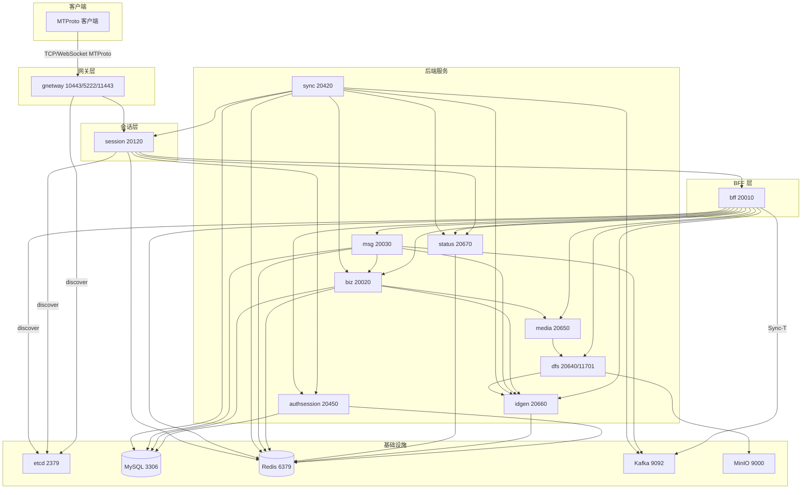

# 服务拓扑与配置说明

本文档根据 `teamgramd/etc/*.yaml` 与 `teamgramd/bin/runall2.sh` 的启动顺序，说明各服务的**端口**、**基础设施依赖**以及**核心调用关系**。

## 启动顺序

服务须按以下顺序启动（与 `runall2.sh` 一致）：

| 顺序 | 服务       | 配置文件           |
|------|------------|--------------------|
| 1    | idgen      | `../etc/idgen.yaml` |
| 2    | status     | `../etc/status.yaml` |
| 3    | authsession| `../etc/authsession.yaml` |
| 4    | dfs        | `../etc/dfs.yaml` |
| 5    | media      | `../etc/media.yaml` |
| 6    | biz        | `../etc/biz.yaml` |
| 7    | msg        | `../etc/msg.yaml` |
| 8    | sync       | `../etc/sync.yaml` |
| 9    | bff        | `../etc/bff.yaml` |
| 10   | session    | `../etc/session.yaml` |
| 11   | gnetway    | `../etc/gnetway.yaml` |
| (可选) | httpserver | `../etc/httpserver.yaml` |

---

## 服务端口与 Etcd Key

| 服务        | RPC/HTTP 监听           | 对客户端暴露（gnetway） | Etcd Key           |
|-------------|--------------------------|--------------------------|--------------------|
| **idgen**   | 127.0.0.1:20660         | —                        | service.idgen      |
| **status**  | 127.0.0.1:20670         | —                        | service.status     |
| **authsession** | 127.0.0.1:20450     | —                        | service.authsession |
| **dfs**     | 127.0.0.1:20640 (gRPC)、0.0.0.0:11701 (HTTP) | — | service.dfs        |
| **media**   | 127.0.0.1:20650         | —                        | service.media      |
| **biz**     | 127.0.0.1:20020         | —                        | service.biz_service |
| **msg**     | 127.0.0.1:20030         | —                        | messenger.msg      |
| **sync**    | 127.0.0.1:20420         | —                        | messenger.sync     |
| **bff**     | 127.0.0.1:20010         | —                        | bff.bff            |
| **session** | 127.0.0.1:20120        | —                        | interface.session  |
| **gnetway** | 127.0.0.1:20110 (内部)  | **10443** (TCP)、**5222** (TCP)、**11443** (WebSocket) | interface.gateway |
| **httpserver** | —                     | **8801** (HTTP)          | —                  |

---

## 基础设施依赖

| 服务        | etcd | MySQL | Redis (Cache/KV) | Kafka        | MinIO |
|-------------|------|-------|------------------|--------------|-------|
| **idgen**   | ✓    | —     | ✓ (SeqIDGen)     | —            | —     |
| **status**  | ✓    | —     | ✓ (Status)       | —            | —     |
| **authsession** | ✓ | ✓     | ✓ (Cache, KV)    | —            | —     |
| **dfs**     | ✓    | —     | ✓ (Cache, SSDB)  | —            | ✓     |
| **media**   | ✓    | ✓     | ✓ (Cache)        | —            | —     |
| **biz**     | ✓    | ✓     | ✓ (Cache, KV)    | —            | —     |
| **msg**     | ✓    | ✓     | ✓ (Cache, KV)    | ✓ (Inbox-T, Sync-T) | — |
| **sync**    | ✓    | ✓     | ✓ (Cache, KV)    | ✓ (Sync-T 消费) | — |
| **bff**     | ✓    | —     | ✓ (KV)            | ✓ (Sync-T 生产) | — |
| **session** | ✓    | —     | ✓ (Cache)        | —            | —     |
| **gnetway** | ✓    | —     | —                 | —            | —     |
| **httpserver** | ✓  | —     | —                 | —            | —     |

配置中默认端点：**etcd** 127.0.0.1:2379、**MySQL** 127.0.0.1:3306、**Redis** 127.0.0.1:6379、**Kafka** 127.0.0.1:9092、**MinIO** localhost:9000。

---

## 核心调用关系

- **gnetway** → 通过 etcd 发现并调用 **session**（interface.session）。
- **session** → 调用 **authsession**、**status**，并将 MTProto RPC 转发到 **bff**（BFFProxyClients）。
- **bff** → 调用 **biz**、**authsession**、**media**、**idgen**、**msg**、**dfs**、**status**，并向 Kafka **Sync-T** 生产消息。
- **biz** → 调用 **media**、**idgen**。
- **msg** → 调用 **idgen**、**biz**；消费 **Inbox-T**，生产/消费 **Sync-T**。
- **sync** → 调用 **idgen**、**status**、**session**、**biz**（Channel/Chat）；消费 **Sync-T**。
- **media** → 调用 **dfs**。
- **dfs** → 调用 **idgen**；使用 MinIO 存储对象。
- **authsession**、**idgen**、**status** 不调用其他 gRPC 服务（仅依赖 etcd、DB、Redis）。

可选的 **httpserver** 仅与 **session** 通信。

---

## Mermaid 拓扑图

---

## 配置文件对照

| 配置文件                  | 服务       |
|---------------------------|------------|
| `teamgramd/etc/idgen.yaml`       | idgen      |
| `teamgramd/etc/status.yaml`      | status     |
| `teamgramd/etc/authsession.yaml` | authsession |
| `teamgramd/etc/dfs.yaml`         | dfs        |
| `teamgramd/etc/media.yaml`       | media      |
| `teamgramd/etc/biz.yaml`         | biz        |
| `teamgramd/etc/msg.yaml`         | msg        |
| `teamgramd/etc/sync.yaml`        | sync       |
| `teamgramd/etc/bff.yaml`         | bff        |
| `teamgramd/etc/session.yaml`     | session    |
| `teamgramd/etc/gnetway.yaml`     | gnetway    |
| `teamgramd/etc/httpserver.yaml`  | httpserver（可选） |

各服务在 **etcd** 中按上表 Key 注册，调用方通过 etcd 发现。根据部署环境修改 `ListenOn`、`Etcd.Hosts` 及各类基础设施 DSN。
