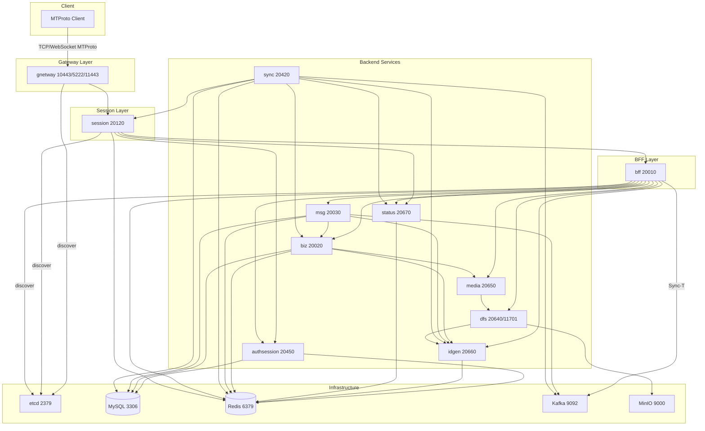

# Service Topology and Configuration

This document describes each service’s **ports**, **infrastructure dependencies**, and **core call relationships** based on `teamgramd/etc/*.yaml` and the startup order in `teamgramd/bin/runall2.sh`.

## Startup order

Services must be started in this order (as in `runall2.sh`):

| Order | Service      | Config file        |
|-------|--------------|--------------------|
| 1     | idgen        | `../etc/idgen.yaml` |
| 2     | status       | `../etc/status.yaml` |
| 3     | authsession  | `../etc/authsession.yaml` |
| 4     | dfs          | `../etc/dfs.yaml` |
| 5     | media        | `../etc/media.yaml` |
| 6     | biz          | `../etc/biz.yaml` |
| 7     | msg          | `../etc/msg.yaml` |
| 8     | sync         | `../etc/sync.yaml` |
| 9     | bff          | `../etc/bff.yaml` |
| 10    | session      | `../etc/session.yaml` |
| 11    | gnetway      | `../etc/gnetway.yaml` |
| (opt) | httpserver   | `../etc/httpserver.yaml` |

---

## Service ports and etcd keys

| Service     | RPC / HTTP listen      | Client-facing (gnetway) | Etcd key           |
|-------------|------------------------|-------------------------|---------------------|
| **idgen**   | 127.0.0.1:20660        | —                       | service.idgen       |
| **status**  | 127.0.0.1:20670        | —                       | service.status      |
| **authsession** | 127.0.0.1:20450    | —                       | service.authsession |
| **dfs**     | 127.0.0.1:20640 (gRPC), 0.0.0.0:11701 (HTTP) | — | service.dfs         |
| **media**   | 127.0.0.1:20650       | —                       | service.media       |
| **biz**     | 127.0.0.1:20020       | —                       | service.biz_service |
| **msg**     | 127.0.0.1:20030       | —                       | messenger.msg      |
| **sync**    | 127.0.0.1:20420       | —                       | messenger.sync     |
| **bff**     | 127.0.0.1:20010       | —                       | bff.bff             |
| **session** | 127.0.0.1:20120      | —                       | interface.session   |
| **gnetway** | 127.0.0.1:20110 (internal) | **10443** (TCP), **5222** (TCP), **11443** (WebSocket) | interface.gateway |
| **httpserver** | —                  | **8801** (HTTP)        | —                   |

---

## Infrastructure dependencies

| Service     | etcd | MySQL | Redis (Cache/KV) | Kafka        | MinIO |
|-------------|------|-------|------------------|--------------|-------|
| **idgen**   | ✓    | —     | ✓ (SeqIDGen)     | —            | —     |
| **status**  | ✓    | —     | ✓ (Status)       | —            | —     |
| **authsession** | ✓ | ✓     | ✓ (Cache, KV)    | —            | —     |
| **dfs**     | ✓    | —     | ✓ (Cache, SSDB)  | —            | ✓     |
| **media**   | ✓    | ✓     | ✓ (Cache)        | —            | —     |
| **biz**     | ✓    | ✓     | ✓ (Cache, KV)    | —            | —     |
| **msg**     | ✓    | ✓     | ✓ (Cache, KV)    | ✓ (Inbox-T, Sync-T) | — |
| **sync**    | ✓    | ✓     | ✓ (Cache, KV)    | ✓ (Sync-T consumer) | — |
| **bff**     | ✓    | —     | ✓ (KV)            | ✓ (Sync-T producer) | — |
| **session** | ✓    | —     | ✓ (Cache)        | —            | —     |
| **gnetway** | ✓    | —     | —                 | —            | —     |
| **httpserver** | ✓  | —     | —                 | —            | —     |

Default endpoints in configs: **etcd** 127.0.0.1:2379, **MySQL** 127.0.0.1:3306, **Redis** 127.0.0.1:6379, **Kafka** 127.0.0.1:9092, **MinIO** localhost:9000.

---

## Core call relationships

- **gnetway** → discovers and uses **session** (interface.session).
- **session** → **authsession**, **status**, **bff** (BFFProxyClients; routes MTProto RPC to bff).
- **bff** → **biz**, **authsession**, **media**, **idgen**, **msg**, **dfs**, **status**; publishes to Kafka **Sync-T**.
- **biz** → **media**, **idgen**.
- **msg** → **idgen**, **biz**; consumes **Inbox-T**, produces/consumes **Sync-T**.
- **sync** → **idgen**, **status**, **session**, **biz** (Channel/Chat); consumes **Sync-T**.
- **media** → **dfs**.
- **dfs** → **idgen**; uses MinIO for object storage.
- **authsession**, **idgen**, **status** → no gRPC callouts (only etcd, DB, Redis).

Optional **httpserver** talks to **session** only.

---

## Mermaid topology diagram

---

## Config file reference

| Config file           | Service    |
|-----------------------|------------|
| `teamgramd/etc/idgen.yaml`       | idgen      |
| `teamgramd/etc/status.yaml`      | status     |
| `teamgramd/etc/authsession.yaml` | authsession |
| `teamgramd/etc/dfs.yaml`         | dfs        |
| `teamgramd/etc/media.yaml`       | media      |
| `teamgramd/etc/biz.yaml`         | biz        |
| `teamgramd/etc/msg.yaml`         | msg        |
| `teamgramd/etc/sync.yaml`        | sync       |
| `teamgramd/etc/bff.yaml`         | bff        |
| `teamgramd/etc/session.yaml`     | session    |
| `teamgramd/etc/gnetway.yaml`     | gnetway    |
| `teamgramd/etc/httpserver.yaml`  | httpserver (optional) |

All services register themselves in **etcd** under the key above; clients discover them via etcd. Change `ListenOn` and `Etcd.Hosts` (and infrastructure DSNs) to match your environment.
