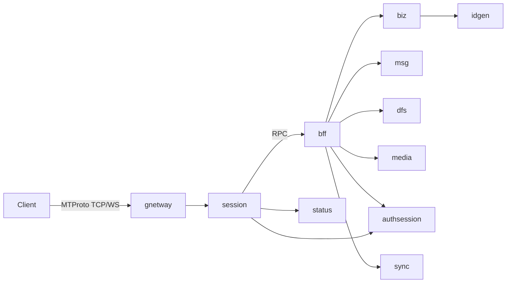

# 架构与数据流

本文档描述 Teamgram Server 的服务拓扑、请求路径及与 MTProto/API 的对应关系。

## 架构图

项目 README 中的整体架构图：

## 服务列表与职责

| 服务 | 默认 RPC 端口 | 对外端口（示例） | 职责 |
|------|----------------|------------------|------|
| **gnetway** | 20110 | 10443 (TCP MTProto)、11443 (WebSocket)、5222 (TCP) | 协议网关：接收客户端 MTProto 连接（TCP/WebSocket），转发到 session |
| **session** | 20120 | - | 会话层：维护用户连接、鉴权状态，将 RPC 路由到 BFF |
| **bff** | 20010 | - | 业务聚合层：将 MTProto RPC 转为对后端服务的调用 |
| **authsession** | 20450 | - | 鉴权会话：登录态、会话校验 |
| **biz** | 20020 | - | 业务核心：用户、聊天、对话、消息、更新等 gRPC 服务 |
| **msg** | 20030 | - | 消息服务：消息存储与投递、inbox |
| **sync** | 20420 | - | 同步服务：多端更新同步 |
| **dfs** | 20640 | 11701 (HTTP 可选) | 分布式文件：上传/下载路由、简单存储逻辑 |
| **media** | 20650 | - | 媒体服务：图片/文档/视频等媒体元数据与处理 |
| **idgen** | 20660 | - | 分布式 ID 生成 |
| **status** | 20670 | - | 用户在线状态 |
| **httpserver** | 8801 | 8801 (HTTP) | 可选：HTTP API 或 Web 回调 |

配置与发现通过 **etcd** 完成；各服务通过 etcd 注册并发现对方（如 session 发现 bff、bff 发现 biz/msg/media 等）。

## 请求路径示意

客户端请求经 MTProto 进入网关，经会话层到 BFF，再由 BFF 调用后端 gRPC 服务；消息与同步经 Kafka 等组件协作。

- **协议层**：客户端连接 gnetway 的 10443（TCP）或 11443（WebSocket）或 5222（TCP），使用 MTProto 2.0（Abridged/Intermediate/Padded intermediate/Full）。
- **会话层**：gnetway 将连接与 session 关联，session 校验 authsession 并查询 status，按 BFFProxyClients 配置将 RPC 转发到 bff。
- **业务层**：bff 根据 RPC 类型调用 biz、msg、dfs、media、sync 等；消息与事件经 Kafka 在 msg、sync、inbox 等之间流转。

## 数据与存储

| 组件 | 用途 |
|------|------|
| **MySQL** | 业务数据：用户、聊天、消息、对话、媒体元数据等；需执行 `teamgramd/sql/` 下初始化与 migrate 脚本 |
| **Redis** | 缓存、会话及去重等 |
| **Kafka** | 消息与事件管道：msg、sync、inbox 等消费者 |
| **MinIO** | 对象存储：文档、加密文件、图片、视频等 bucket（documents、encryptedfiles、photos、videos） |
| **etcd** | 服务发现与配置：各服务 ListenOn 与 etcd Key 见 `teamgramd/etc/*.yaml` |

## 端口与配置

- 对外暴露给客户端的端口以 **gnetway** 配置为准（默认 10443、11443、5222）；其余端口为内部 RPC 或 HTTP，部署时可按需绑定到 localhost 或内网。
- 各服务 YAML 位于 `teamgramd/etc/`，二进制由 `make` 构建到 `teamgramd/bin/`，启动顺序见 `teamgramd/bin/runall2.sh`（idgen → status → authsession → dfs → media → biz → msg → sync → bff → session → gnetway）。
